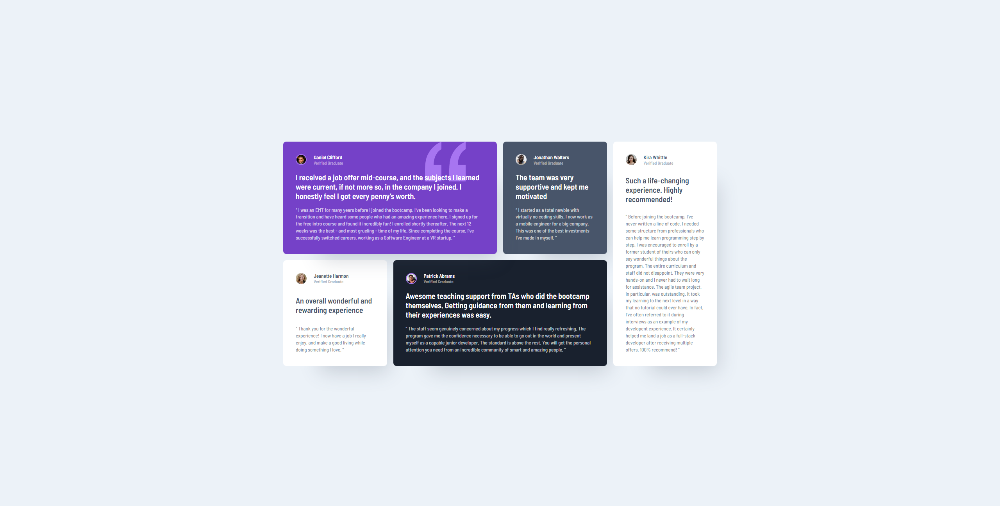

# Frontend Mentor - Testimonials grid section solution

This is a solution to the [Testimonials grid section challenge on Frontend Mentor](https://www.frontendmentor.io/challenges/testimonials-grid-section-Nnw6J7Un7). Frontend Mentor challenges help you improve your coding skills by building realistic projects.

## Table of contents

- [Overview](#overview)
  - [The challenge](#the-challenge)
  - [Screenshot](#screenshot)
  - [Links](#links)
- [My process](#my-process)
  - [Built with](#built-with)
  - [What I learned](#what-i-learned)
  - [Useful resources](#useful-resources)
- [Author](#author)

## Overview

### The challenge

Users should be able to:

- View the optimal layout for the site depending on their device's screen size

### Screenshot

### Links

- Solution URL: [GitHub](https://github.com/awongdev/testimonials-grid)
- Live Site URL: [https://awongdev.github.io/testimonials-grid/](https://awongdev.github.io/testimonials-grid/)

## My process

### Built with

- Semantic HTML5 markup
- CSS custom properties
- Flexbox
- CSS Grid
- Mobile-first workflow

### What I learned

Took on this project to practice CSS grid layouts.

### Useful resources

- [CSS Grid](https://css-tricks.com/snippets/css/complete-guide-grid/) - Great guide for grid.

## Author

- Frontend Mentor - [@AceDub](https://www.frontendmentor.io/profile/AceDub)
- GitHub - [@awongdev](https://github.com/awongdev)
